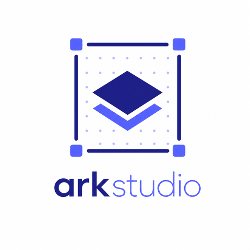

<div align="center">



# Canvas Flow

**English** · [简体中文](README.zh.md)

**Node-based AI creation canvas · Chinese-first · Desktop app + self-hostable**

AI generation as a draggable canvas — connect text / image / video / audio nodes into a pipeline, run with one click, preview results in place.

[![CI][ci-shield]][ci-link]
[![License: AGPL-3.0][license-shield]][license-link]
[![CLA][cla-shield]][cla-link]
[![Made with DashScope][bailian-shield]][bailian-link]
[![Issues][issues-shield]][issues-link]

[Desktop](docs/desktop.md) · [Deployment](docs/deployment.md) · [Development](docs/development.md) · [Model integration](MODEL_INTEGRATION.md) · [For external teams](docs/external-teams.md) · [Report an issue][issues-link]

</div>

<!-- TODO: screenshot placeholder — uncomment after dropping images into ./docs/screenshots/


-->

---

## What is it

The same "node-based AI creation canvas" category as [TapNow](https://app.tapnow.ai/), [LibTV](https://libtv.gongke.net/) and [RHTV](https://www.runninghub.ai/) — main differences:

|  | Canvas Flow | TapNow / LibTV / RHTV |
|---|---|---|
| Form factor | **Desktop single-binary (.dmg / .exe) + self-hosted (Docker)** (AGPL-3.0) | Closed-source SaaS |
| Models | First-class **Alibaba Cloud Bailian (DashScope)**, OpenAI-protocol Provider easily slots in for other sources | Each integrates 30–170 cloud models |
| Configuration | Nodes / models / Provider credentials all **DB-driven**, admin UI edits take effect immediately | Backend is open to operators, closed to forkers |
| Commercial use | Self-hosting + forking allowed (within AGPL terms), good for vertical / private deployments | Subscription $9–$432/month |
| Localisation | Chinese UI / Chinese docs / Chinese defaults | English-first |

In short — **if you want a fork-friendly, private-model-friendly, self-hostable "Chinese TapNow", start here.**

## What it can do

Every scenario below maps to a linear pipeline of connected nodes on the canvas:

- **E-commerce hero shots / multi-SKU renders** — `text(prompt) → image(wan2.7-image-pro) → image(wan2.7-image-pro, referencing previous)`
- **30-second short video** — `text(script) → image(storyboard) → video(wan2.7-i2v, referencing storyboard) → audio(MiniMax-tts)`
- **Ad TVC batch variants** — one prompt + group-run, produce N resolutions / aspect ratios in one shot
- **Character three-view consistency** — `image(base character) → image(wan2.7-image-pro, multiple edits)`
- **Voiceover + BGM** — `text → audio(tts) + audio(FunMusic)`

Each node's "model + params + inputs + outputs" lands in a single-file SQLite DB. You can browse history, re-run, and view usage by kind from `/admin`.

## Key features

- 🎨 **Node canvas editor** — drag / connect / group / box-select / cross-node `@image1` references, powered by our own [`@canvas-flow/core`](packages/core)
- 🖥️ **Desktop single binary** — Electron packs backend + web + SQLite into a single .dmg / .exe, double-click to run, zero dependencies, [full guide](docs/desktop.md)
- 🛠 **DB as source of truth** — node definitions / model catalog / Provider credentials / storage settings all stored in single-file SQLite, admin edits apply on the next request, no code changes or restart needed
- 🔌 **Provider abstraction** — DashScope (Bailian) + OpenAI-compatible protocol (chat / image, can point to OpenRouter / vLLM / DeepSeek / self-hosted gateways); `src/providers/` is SPI-style, adding a new source = one new file
- 💾 **Local-first storage (ComfyUI-style)** — uploads / generation results write directly to the backend's disk, no cloud credentials needed; when i2i / i2v requires a public URL, the dashscope provider auto-stages files through Bailian's 48h temp bucket
- 📦 **Zero-config out-of-the-box** — one `DASHSCOPE_API_KEY` is enough to wire up the full pipeline
- 🧹 **Self-managing generation history** — throttle-cleans on each new generation, no cron dependency; retention days + per-kind count threshold adjustable from admin
- 🔐 **Encrypted at rest** — `dashscope.apiKey` / `openai.apiKey` and other sensitive fields encrypted with AES-256-GCM, UI never echoes plaintext, edits are "overwrite only"
- 🇨🇳 **Chinese-first** — UI / error messages / docs / node default parameters all tuned for Chinese scenarios; not a machine-translated English project
- ⚖️ **AGPL §13 built-in** — the "Source · License" card at the top of `/admin/system` always exposes the repo URL + license + current version

## Quick Start

Pick one — desktop for personal / single-machine use, Docker for team / server deployments.

### Desktop (recommended for personal / offline use)

Grab the installer for your platform from [Releases](https://github.com/arkstudio-ai/arkstudio-canvas/releases):

| Platform | File |
|---|---|
| macOS Apple Silicon | `Canvas Flow-<version>-arm64.dmg` |
| macOS Intel | `Canvas Flow-<version>.dmg` |
| Windows 10/11 x64 | `Canvas Flow Setup <version>.exe` |

> Installers are currently unsigned — first open on macOS requires right-click → Open / on Windows click "More info → Run anyway".
> Full install / upgrade / uninstall / troubleshooting → [🖥️ Desktop guide](docs/desktop.md).

### Docker self-host (recommended for team / server)

```bash
git clone https://github.com/arkstudio-ai/arkstudio-canvas.git canvas-flow && cd canvas-flow
cp .env.docker.example .env  # edit ENCRYPTION_KEY
docker compose up -d --build
```

Open <http://localhost:8080/admin/system> and drop in a DashScope API Key — that's it.

> Full steps, configuration reference, backup / upgrade / troubleshooting → [📦 Deployment guide](docs/deployment.md).

## Where do files live

The open-source build has exactly one storage backend: **write to the backend server's local disk** (ComfyUI-style, zero cloud credentials required).

| Mode | Default data directory | Persistence |
|---|---|---|
| Docker compose | `/data/uploads` (in-container) | named volume `canvas_flow_uploads`, survives `docker compose down` |
| Local dev (`pnpm dev`) | path set by `STORAGE_LOCAL_DATA_DIR` in `apps/backend/.env` (recommend `<repo>/.dev-uploads`, already gitignored) | direct host disk |

External access is served via the same-origin relative path `/static/uploads/<key>`, no CORS.

How to change it (by priority):

1. **At runtime via admin**: log into `/admin/system → Local storage`, edit `data directory` and `per-file size limit`
2. **Via env**: set `STORAGE_LOCAL_DATA_DIR=...` in `.env` / `.env.docker.example` (takes effect on first start, admin config overrides afterwards)
3. **Via mount (recommended for production)**: in `docker-compose.yml`'s backend service, swap the named volume for a host directory, e.g. `/srv/canvas-flow/uploads:/data/uploads` for easy backup

> When the i2i / i2v pipeline needs Alibaba Cloud models to read a local image, the dashscope provider auto-uploads it to Bailian's 48h temp bucket (`oss://`) before invoking the model; the final result still lands on local disk. Full explanation in [Deployment · storage strategy](docs/deployment.md#存储策略local-only).

## Documentation

| What you want to do | Read this |
|---|---|
| **Install the desktop app for personal / offline use** | [🖥️ Desktop guide](docs/desktop.md) |
| **Run it for a team** | [📦 Deployment guide](docs/deployment.md) |
| **Pull source and hack on it** | [💻 Development guide](docs/development.md) |
| **Add a new model / OpenAI-compat endpoint / storage backend** | [🔌 Model integration guide](MODEL_INTEGRATION.md) |
| **Understand layering · desktop vs self-hosted split** | [🧱 Architecture](docs/architecture.md) |
| Per-package internals | [`apps/backend/README.md`](apps/backend/README.md) · [`apps/web/README.md`](apps/web/README.md) · [`apps/desktop/README.md`](apps/desktop/README.md) · [`packages/core/README.md`](packages/core/README.md) |

## Roadmap

**Phase 1 (shipped)**

- Canvas editor + admin dashboard + full DashScope model matrix + local disk storage + history retention + encrypted credentials
- **OpenAI-compatible Provider** (chat / image) — any OpenAI-protocol baseUrl + apiKey slots in
- **Node / model config import-export** — at the top of `/admin/config`, one-click export / import portable JSON envelope, cross-instance sync / git-able
- Docker compose one-shot deployment + AGPL §13 compliance UI

**Coming up (by priority)**

- **Optional remote storage backends** — S3 / OSS / R2 abstraction (for production multi-instance deployments)
- **Automated test coverage** — unit + e2e
- **Canvas JSON sharing** — turn the top-right share button into "export shareable canvas JSON"

> Want to nudge priorities? Open an RFC under [Issues][issues-link].

## Contributing

All forms of contribution welcome:

1. 🐛 **Bug reports** — describe repro steps under [Issues][issues-link]
2. 💡 **Feature requests** — same, discuss before code
3. 📝 **Doc edits** — any README / docs/* revision welcome
4. 🚀 **Code** — Fork → branch → PR; flow detailed in [Development guide](docs/development.md#贡献流程)

> For big directions (new Provider types, architecture changes), open an issue first to align — avoids rework.

## Commercial / License

Canvas Flow is **dual-licensed**.

### Open source · [AGPL-3.0](LICENSE)

- ✅ **Allowed**: self-host, modify, build vertical / private deployments, offer it as SaaS
- ⚠️ **Required**: your modifications must also be open-sourced back under AGPL (including SaaS deployments — this is AGPL's key difference from GPL, §13 network interaction clause)
- ✅ **Compliance built in**: the "Source · License" card at the top of `/admin/system` auto-exposes source URL + license + current version, so operators satisfy §13 with zero config

### Commercial · [LICENSE-COMMERCIAL.md](LICENSE-COMMERCIAL.md)

If AGPL's reciprocity doesn't fit your business model (e.g. fully closed-source SaaS, removing the Source card, private on-premise delivery without source disclosure), a commercial license is available for purchase.

**Contact**: bbdwxh@gmail.com · See [For external teams](docs/external-teams.md) for the full decision tree

> The copyright holder retains the right to re-license this repository's code under alternative terms. External contributors must sign the [CLA](CLA.md) before their PRs can be merged (corporate contributors follow the [CCLA](CLA-CORPORATE.md) process).

---

<div align="center">

If this project helps you, leaving a ⭐ is the best encouragement.

</div>

<!-- Badges -->
[ci-shield]: https://github.com/arkstudio-ai/arkstudio-canvas/actions/workflows/ci.yml/badge.svg?branch=main
[ci-link]: https://github.com/arkstudio-ai/arkstudio-canvas/actions/workflows/ci.yml
[license-shield]: https://img.shields.io/badge/License-AGPLv3-important.svg?logo=gnu
[license-link]: https://github.com/arkstudio-ai/arkstudio-canvas/blob/main/LICENSE
[cla-shield]: https://img.shields.io/badge/CLA-Required-blueviolet?logo=githubactions
[cla-link]: https://github.com/arkstudio-ai/arkstudio-canvas/blob/main/CONTRIBUTING.md
[bailian-shield]: https://img.shields.io/badge/Powered%20by-DashScope%20%2F%20Bailian-FF6A00
[bailian-link]: https://bailian.console.aliyun.com/
[issues-shield]: https://img.shields.io/github/issues/arkstudio-ai/arkstudio-canvas?logo=github
[issues-link]: https://github.com/arkstudio-ai/arkstudio-canvas/issues
